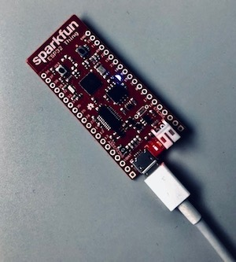
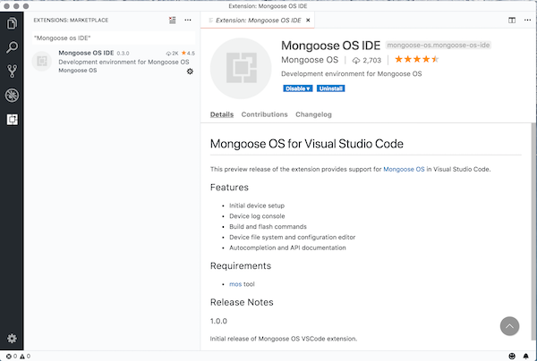

# Visual Studio Code setup for  ESP32 and Mongoose OS

## Overview
I decided to document my workflow, and hopefully, it will help someone else. I use the Sparkfun ESP32 Thing board which has both a LED and a button. The button is connected to PIN0 and the LED is connected to PIN5.



Schematics can be found [here](./docs/esp32-thing-schematic.pdf)

## Install and use mos Tool

Install the [mos tool](https://mongoose-os.com/software.html). I work with several ESP32 Thing boards, so I prefer not to set the serial port in my bash profile. On my Mac I do the following:

```
export MOS_PORT=/dev/cu.usbserial-DN02XXXX

```

Or specify it when I flash my device

```
mos flash --port /dev/cu.usbserial-DN02XXXX

```

I prefer not to use the web-based mos tool instead use the CLI.


### Building remotely

```
time mos build --arch esp32
```

### Building locally, (Docker needs to be running)

```
time mos build --local --arch esp32
```

When you build it locally a directory called /deps is created and source code to all your dependencies are downloaded locally.

When working with the JavaScript file you can easily copy the file to the target. Enter the fs folder and do the following:

```
$ pwd
/git/himinds-iot-project-embedded-esp32-mongoose-os-vscode-setup
$ cd fs
/git/himinds-iot-project-embedded-esp32-mongoose-os-vscode-setup/fs 
$ mos put init.js
```


## Tree structure
 
 This is my tree structure:
 
```
├── esp-idf
├── mjs
├── mongoose-os
└── himinds-iot-project-embedded-esp32-mongoose-os-vscode-setup
```


I have cloned:

```
git clone https://github.com/espressif/esp-idf.git
git clone https://github.com/cesanta/mjs.git
git clone https://github.com/cesanta/mongoose-os.git
```


# Visual Studio Code

First, you need to install the C/C++ Extension for Visual Studio Code extension if you haven't already done that.

There is a Mongoose OS extension which is pretty sweet:




I have added the following to my user settings in Visual Studio Code:

```json
{    
    "C_Cpp.intelliSenseEngineFallback": "Enabled",
     "files.associations": {
        "mgos.h": "c"        
    },
    "C_Cpp.intelliSenseEngine": "Tag Parser"
}
```

More information can be found here:
https://github.com/Microsoft/vscode-cpptools/blob/master/Documentation/LanguageServer/c_cpp_properties.json.md

In your folder .vscode you should find the c_cpp_properties.json, add the following: 

```json
 "includePath": [
                "${workspaceFolder}/**",
                "/your path/git/mongoose-os/",
                "/your path/git/esp-idf/",
                "/your path/git/mjs/"
            ]
```

Now IntelliSense should be able to find your files.

# init.js code
The JavaScript code does the following

- Configures the LED and creates a timer that blinks it every 3 seconds
- Configures the button and creates a callback that toggles the LED
- Override conf0.json with custom config_schema in mos.yml
- Configure ADC via a call to C code

# main.c code

The code demonstrates how to adjust the attenuation for the ADC. Allowed values are:

* ADC_ATTEN_0db
* ADC_ATTEN_2_5db
* ADC_ATTEN_6db
* ADC_ATTEN_11db

*Why do you want to adjust the attenuation?*

There is a known issue with the Non-Linearity of the ESP32 ADCs but 6dB or 0dB attenuation has okay linearity. We will explore this more in coming projects. For now we want to be able to change it. 
Looking at the code in https://github.com/mongoose-os-libs/adc/blob/master/esp32/src/esp32_adc.c we see that the default value is set to ADC_ATTEN_11db.

```c
bool mgos_adc_enable(int pin) {
  struct esp32_adc_channel_info *ci = esp32_adc_get_channel_info(pin);
  if (ci == NULL) return false;

  /* TODO(rojer): Allow changing? */
  ci->atten = ADC_ATTEN_11db;

  return esp32_update_channel_settings(ci);
}

```

In the Espressif Systems adc.h we can see the following:

```c
typedef enum {
    ADC_ATTEN_DB_0   = 0,  /*!<The input voltage of ADC will be reduced to about 1/1 */
    ADC_ATTEN_DB_2_5 = 1,  /*!<The input voltage of ADC will be reduced to about 1/1.34 */
    ADC_ATTEN_DB_6   = 2,  /*!<The input voltage of ADC will be reduced to about 1/2 */
    ADC_ATTEN_DB_11  = 3,  /*!<The input voltage of ADC will be reduced to about 1/3.6*/
    ADC_ATTEN_MAX,
} adc_atten_t;
```

As suggested in https://github.com/cesanta/mongoose-os/issues/285 we can do the following from JavaScript:

```javascript

let MYADC = {
  cfg: ffi('int adc1_config_channel_atten(int, int)'),  // that function must be in the SDK
};

let db6 = 2;  // whatever the numeric value for 6 dB is 2
MYADC.cfg(pin, db6);

```

Looking in our main.c, in the function pc_adc_configuration we do a little bit more. 
More information can be found here:
https://docs.espressif.com/projects/esp-idf/en/latest/api-reference/peripherals/adc.html


